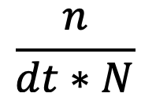
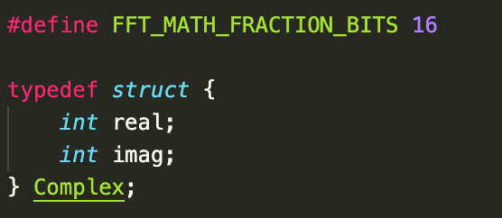

<h1 align="center">Cordic math</h3>

  

    Project Decription
     
    <a href="https://github.com/Flaxyson/Cordic-Math"><strong>Explore the docs »</strong></a>
     
     
    ·
    <a href="https://github.com/Flaxyson/Cordic-Math/issues">Report Bug</a>
    ·
    <a href="https://github.com/Flaxyson/Cordic-Math/issues">Request Feature</a>
  

 

## About The CORDIC Algorithm

The cordic algorithm is a simple and efficient algorithm to calculate trigonometric functions, hyperbolic functions, square roots, multiplications, divisions, exponentials, logarithms and more. The cordic algorithm dates back to 1956 but still work great for microcontrollers and such today.

Cordic uses simple simple bit-shift operations for several computing tasks. In the library I included other mathimatical functions aswell that might be useful for future users.

***All the inputs and outputs are in degrees!***

Polar to rectangular conversion takes a pointer to a struct. The struct is defined in the cordic-math.h file. 
- Rectangular to polar form takes the input on the x & y variable, and the result is given in the r & theta variable.
- Polar to rectangular form takes the input on the theta & r variable, and the result is given in the x & y variable.

(<a href="#top">back to top</a>)

## Modifying The Code

The code is built around the defined variable CORDIC_MATH_FRACTION_BITS in cordic-math.h file. As default this is set to 16, which means the calculations is made in 16 bit fixed point arithmetic. This variable can easily be changed by future users to change the fixedpoint to suite their needs.

There is also another define in the cordic-math.h file which is named CORDIC_SPEED_FACTOR. If more speed is needed and accuracy is not as important this variable can be changed. It's recomended to not change this variable lower than 8 or higher than 15.

(<a href="#top">back to top</a>)

## Accuracy
The following image shows the precision of the Cordic algorithm. The left column is math.h and the right column is the Cordic algorithm. The input was randomly picked and the result was the following:

(<a href="#top">back to top</a>)

## Functions

- [x] Arctan
- [x] Arcsin
- [x] Arccos
- [x] Tan
- [x] Cos
- [x] Sin
- [x] Squareroot
- [x] Calculation of Hypotenuse
- [x] Arctan Hyperbolic
- [x] Arcsin Hyperbolic
- [x] Arccos Hyperbolic
- [x] Tan Hyperbolic
- [x] Cos Hyperbolic
- [x] Sin Hyperbolic
- [x] e to the Power
- [x] x to the Power
- [x] Natural logratihm
- [x] Conversion From Radians to Degrees
- [x] Conversion From Degrees to Radians
- [x] Absolute
- [x] Is Odd
- [x] Is Even
- [x] Rectangular to Polar Conversion
- [x] Polar to Rectangular Conversion

(<a href="#top">back to top</a>)

<h1 align="center">FFT</h3>

 

    Project Decription
     
    <a href="https://github.com/Max-Gulda/Cordic-Math/tree/main/lib/FFT"><strong>Explore»</strong></a>
     
     
    ·
    <a href="https://github.com/Flaxyson/Cordic-Math/issues">Report Bug</a>
    ·
    <a href="https://github.com/Flaxyson/Cordic-Math/issues">Request Feature</a>
  

 

## About the Fast Fourier Transform

A fast Fourier transform (FFT) is an algorithm that computes the discrete Fourier transform (DFT) of a sequence, or its inverse (IDFT). Fourier transform converts a signal from its original domain (often time) to a representation in the frequency domain. DFT requires O(n^2) which is often to slow to be practical. FFT rapidly computes such transformations by factorizing the DFT-matrix, as a result it manages to reduce the complexity of computing the DFT from O(O^2) to O(N log N). The difference in speed can be enormous especially for long data sets where N may be in the thousands or millions.

<strong>For the following formulas:</strong>

<strong>N</strong> = The total number of sample nodes.

<strong>n</strong> = a specific index.

<strong>dt</strong> = the sample time.

Once you’ve called the fft() function multiply the 0:th element with:

Then multiply every element except the 0:th with:

To obtain the frequency that any index represents use the following formula: 

## About the code

The code is built around a complex datatype defined in fft.h the algorithm is also based on the fixed-point arithmetic to calculate faster on microcontroller units (MCU) that does not support float datatypes. The number of fraction bits is defined in the fft.h file as FFT_MATH_FRACTION_BITS (default is set as 16).

## Sinusoid wave
In the picture below you can observe the result of the fourier transform for two simple sinusoid waves added togheter. 12 Hz with an amplitude of 0.1 and 3 Hz with an amplitude of 0.2. This data is calculated with the Cordic Sin library which explains the small deviations. 

## Fourier Transform
In the picture below you can see the fourier spectrum of the combination of these sinusoid waves.

## Inverse Fourier Transform
In the picture below the inverse fourier transform is calculated on the frequency spectrum resulting in a graph that is very close to the original sinusoid wave.

(<a href="#top">back to top</a>)
